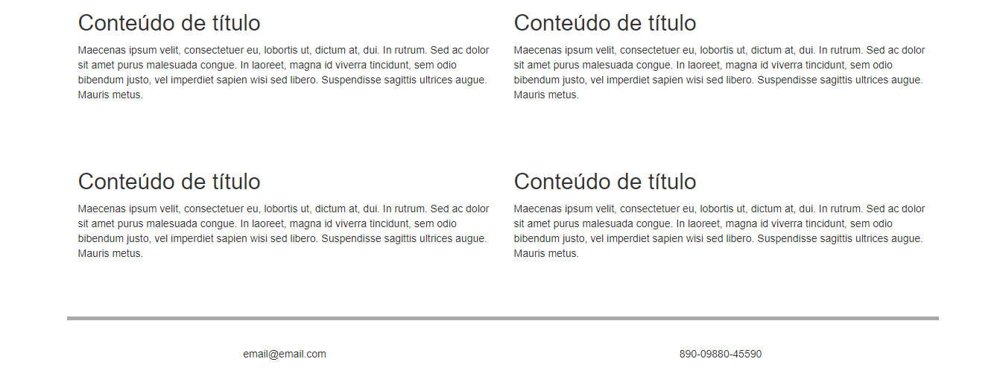

<h3 align="center">
    Bootstrap
</h3>  

## 💻 Sobre o projeto

Projeto feito para treinos com bootstrap , na  WomakersCode.

## 🛠 Tecnologias

O projeto foi desenvolvido utilizando o framework Bootstrap.

## 🎨 Layout

---

<b>Feito com 	:coffee:   por Larisse Lima</b>

